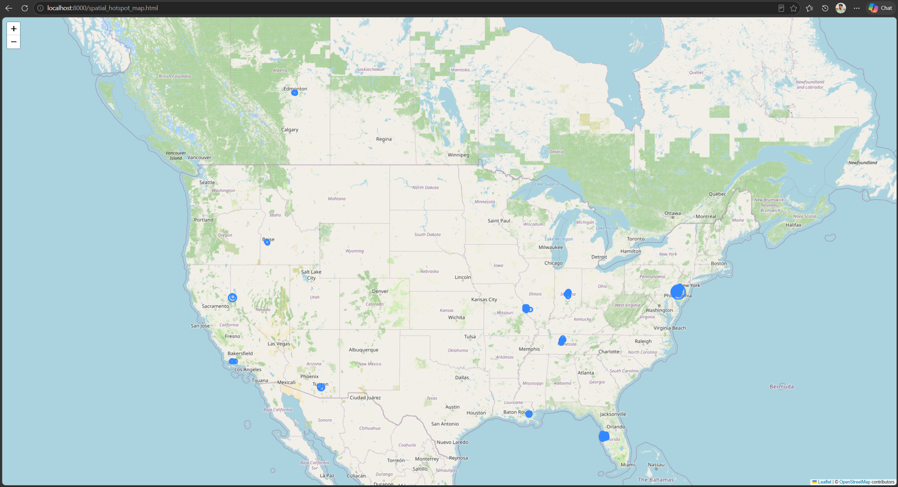
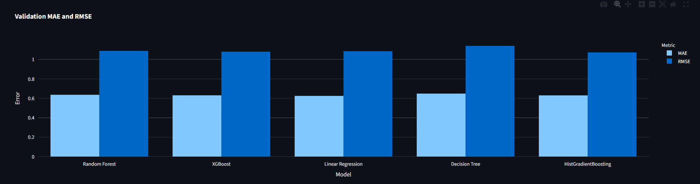
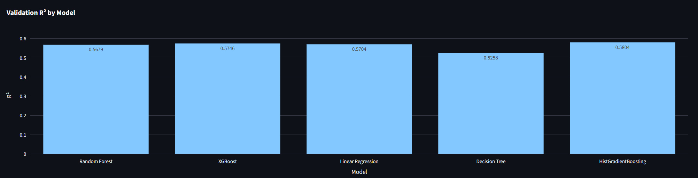
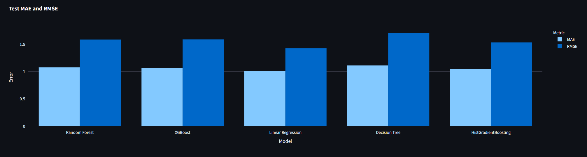
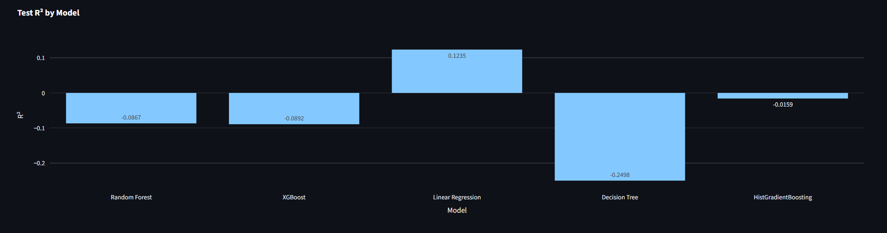
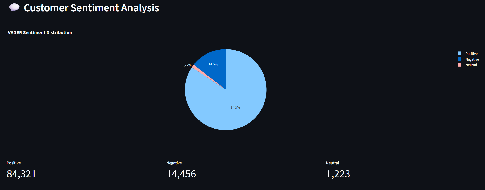
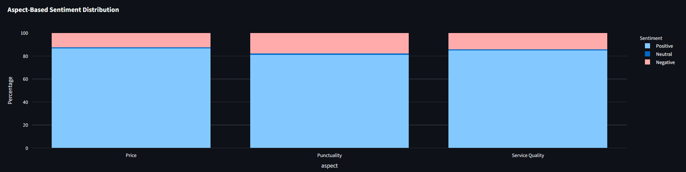
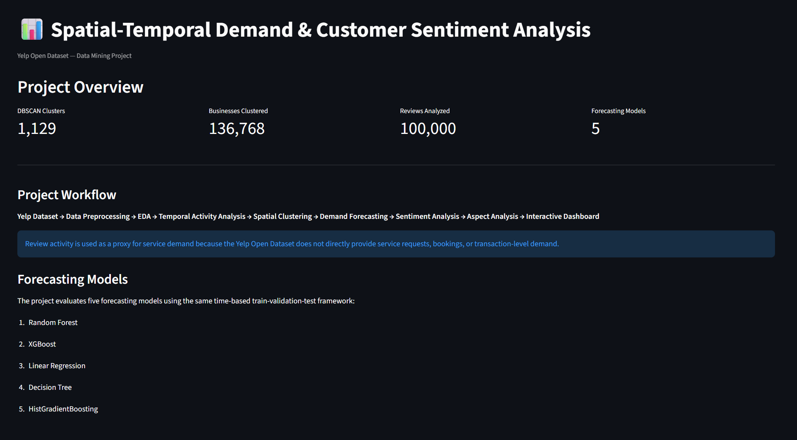

# Spatial-Temporal Demand & Customer Sentiment Analysis

An end-to-end data mining project using the **Yelp Open Dataset** to analyze spatial business activity, temporal review activity, demand forecasting, and customer sentiment.

> **Important:** The Yelp Open Dataset does not contain direct service-request, booking, sales, or transaction records. Therefore, this project uses **monthly review activity as a proxy for observed customer activity/demand**.

## 📌 Project Overview

This project applies multiple data mining and machine learning techniques to extract meaningful insights from Yelp business and review data.

The complete pipeline includes:

* Data collection and preprocessing
* Exploratory Data Analysis (EDA)
* Spatial hotspot detection using DBSCAN
* Monthly review-activity forecasting
* Comparison of five regression models
* Customer sentiment analysis using VADER
* Aspect-based sentiment analysis
* Interactive visualization
* Streamlit dashboard development

## 🔄 Methodology

```text
Yelp Open Dataset
       ↓
Data Collection
       ↓
Data Cleaning & Preprocessing
       ↓
Feature Engineering
       ↓
Exploratory Data Analysis
       ↓
Spatial Hotspot Clustering
       ↓
Demand Forecasting
       ↓
Customer Sentiment Analysis
       ↓
Aspect-Based Analysis
       ↓
Visualization
       ↓
Interactive Streamlit Dashboard
```

## 📊 Dataset

The project uses the **Yelp Open Dataset**, which contains business information and millions of customer reviews.

### Main datasets used

* `yelp_academic_dataset_business.json`
* `yelp_academic_dataset_review.json`

The business dataset contains approximately **150,346 businesses**, while the review dataset contains approximately **6.99 million reviews**.

Because the review dataset is several gigabytes in size, chunk-based and memory-conscious processing techniques were used.

### Dataset Source

[Yelp Open Dataset on Kaggle](https://www.kaggle.com/yelp-dataset/yelp-dataset)

## 🧹 Data Preprocessing

The preprocessing stage included:

* Checking missing values
* Checking duplicate business IDs
* Processing review dates
* Joining business and review information using `business_id`
* Aggregating reviews by business and month
* Creating a complete business-month timeline
* Filling months with no reviews using zero activity
* Preparing geographic coordinates for spatial analysis
* Preparing features for machine learning

## 🗺️ Spatial Hotspot Analysis

**DBSCAN (Density-Based Spatial Clustering of Applications with Noise)** was used to identify geographic concentrations of businesses.

### Configuration

* Distance metric: Haversine
* `eps`: 0.5 km
* `min_samples`: 10
* Geographic coordinates converted to radians
* Noise points were identified as cluster `-1`

### Result

* Total clusters: **1,129**
* Businesses assigned to clusters: **136,768**
* Noise businesses: **13,578**
* Clustered businesses: **90.97%**

The spatial analysis identifies areas with dense concentrations of businesses rather than individual restaurant or service recommendations.



## 📈 Demand Forecasting

Monthly review activity per business was used as the forecasting target.

### Engineered Features

* `lag_1`
* `lag_2`
* `lag_3`
* `rolling_mean_3`
* `month_sin`
* `month_cos`
* Business star rating

Five regression models were evaluated:

1. Random Forest
2. XGBoost
3. Linear Regression
4. Decision Tree
5. HistGradientBoosting

### Model Comparison

| Model                | Val. MAE |  Val. RMSE |    Val. R² |   Test MAE |  Test RMSE |    Test R² |
| -------------------- | -------: | ---------: | ---------: | ---------: | ---------: | ---------: |
| Random Forest        |   0.6357 |     1.0872 |     0.5679 |     1.0773 |     1.5858 |    -0.0867 |
| XGBoost              |   0.6302 |     1.0788 |     0.5746 |     1.0676 |     1.5876 |    -0.0892 |
| Linear Regression    |   0.6244 |     1.0841 |     0.5704 | **1.0076** | **1.4242** | **0.1235** |
| Decision Tree        |   0.6479 |     1.1390 |     0.5258 |     1.1115 |     1.7006 |    -0.2498 |
| HistGradientBoosting |   0.6296 | **1.0715** | **0.5804** |     1.0513 |     1.5332 |    -0.0159 |

On the validation set, HistGradientBoosting achieved the highest R² and lowest RMSE. On the available test period, Linear Regression achieved the best MAE, RMSE, and R².

> The test data represents only the available **January 2022 period (January 1–19)**, not a complete year.

### Validation Results





### Test Results





## 💬 Customer Sentiment Analysis

The **VADER sentiment analyzer** was applied to a sample of **100,000 Yelp reviews**.

### Sentiment Distribution

* Positive: **84.32%**
* Negative: **14.46%**
* Neutral: **1.22%**



For evaluation, Yelp star ratings were converted into weak/proxy sentiment labels. VADER achieved:

| Metric             |  Score |
| ------------------ | -----: |
| Accuracy           | 0.7777 |
| Weighted Precision | 0.7269 |
| Weighted Recall    | 0.7777 |
| Weighted F1-score  | 0.7318 |

> These are evaluations against **proxy star-based labels**, not manually annotated human ground-truth sentiment labels.

## 🔎 Aspect-Based Sentiment Analysis

A rule-based keyword approach was used to identify sentiment around three selected aspects:

* **Price**
* **Punctuality**
* **Service Quality**

### Aspect Sentiment Distribution

| Aspect          | Positive | Neutral | Negative |
| --------------- | -------: | ------: | -------: |
| Price           |   86.62% |   0.86% |   12.53% |
| Punctuality     |   81.12% |   1.13% |   17.75% |
| Service Quality |   84.98% |   0.72% |   14.30% |

Among the three aspects, **Punctuality had the highest proportion of negative sentiment (17.75%)** in the analyzed sample.



## 🖥️ Interactive Dashboard

The project includes an interactive **Streamlit dashboard** containing:

* Project overview
* Spatial hotspot analysis
* DBSCAN cluster visualization
* Forecasting model comparison
* Customer sentiment analysis
* Aspect-based sentiment analysis



### Dashboard Sections

```text
Overview
├── Project Summary
├── Workflow
└── Key Information

Spatial Hotspots
├── DBSCAN Results
├── Cluster Summary
└── Interactive Map

Demand Forecasting
├── Five-Model Comparison
├── Validation Metrics
└── Test Metrics

Customer Sentiment
├── Sentiment Distribution
└── Evaluation Metrics

Aspect Analysis
├── Price
├── Punctuality
└── Service Quality
```

## 🛠️ Technologies Used

* **Python**
* **Pandas**
* **NumPy**
* **Scikit-learn**
* **XGBoost**
* **NLTK / VADER**
* **Plotly**
* **Folium**
* **Streamlit**
* **Matplotlib**
* **Seaborn**

## 📁 Project Structure

```text
service-demand-analysis/
│
├── app.py
├── requirements.txt
├── README.md
├── .gitignore
│
├── scripts/
│   ├── build_monthly_activity.py
│   ├── build_forecasting_dataset_v2.py
│   ├── prepare_spatial_data.py
│   ├── final_dbscan.py
│   ├── create_hotspot_map.py
│   ├── train_additional_models.py
│   ├── sentiment_analysis.py
│   ├── evaluate_sentiment.py
│   └── aspect_analysis.py
│
├── data/
│   └── processed/
│
├── images/
│   ├── methodology_workflow.jpg
│   ├── spatial_hotspot_map.png
│   ├── validation_comparison.png
│   ├── validation_r2_comparison.png
│   ├── test_comparison.png
│   ├── test_r2_comparison.png
│   ├── sentiment_distribution.png
│   ├── aspect_sentiment_distribution.png
│   └── dashboard_overview.png
│
└── report/
    └── final_report.pdf
```

## 📄 Project Report

The complete academic report is available here:

**[View Final Report](report/final_report.pdf)**

## ⚠️ Limitations

Several limitations should be considered when interpreting the results:

1. Yelp does not provide direct service-request or transaction data.
2. Review activity is therefore used as a proxy for customer activity/demand.
3. Review dates represent review posting dates, not necessarily service-consumption dates.
4. VADER sentiment was evaluated using weak/proxy star-based labels.
5. Aspect detection uses rule-based keyword matching and may miss contextual meanings.
6. The forecasting test period contains only January 1–19, 2022 observations.
7. The Yelp dataset covers multiple geographic regions, including Canada, rather than only the United States.

## 🎯 Key Findings

* Yelp business activity is geographically concentrated in identifiable hotspots.
* DBSCAN detected **1,129 spatial clusters**.
* Historical review activity contains useful temporal patterns for forecasting.
* HistGradientBoosting performed best on validation R² and RMSE.
* Linear Regression performed best on the available January 2022 test period.
* Overall VADER sentiment was predominantly positive.
* Punctuality showed the highest negative sentiment proportion among the selected aspects.
* The Streamlit dashboard integrates the major analytical components into one interactive interface.

## 👥 Team Members

| Name           | Student ID |
| -------------- | ---------- |
| Sunjid Ferdous | 011213091  |
| Md. Asik Ali   | 011221365  |
| Israt Jahan    | 0112230056 |

## 🎓 Course

**CSE 4891 — Data Mining**
Section: D
United International University
Summer 262

**Instructor:** Mr. Hafijul Hoque Chowdhury

---

## 📌 Reproducibility

Raw Yelp dataset files are intentionally excluded from this repository because of their large size.

The repository contains the source code, processed analytical outputs required by the dashboard, visual assets, report, and dependency information needed to understand and reproduce the project workflow.

---

**Spatial-Temporal Demand & Customer Sentiment Analysis**
*Data Mining Project — United International University*
